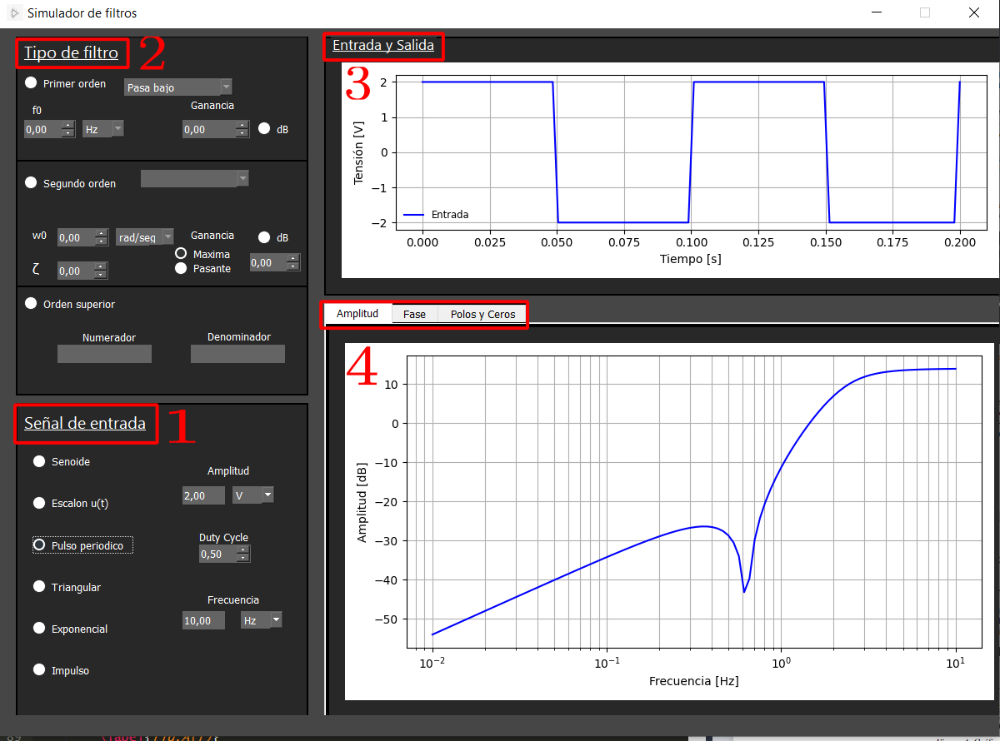
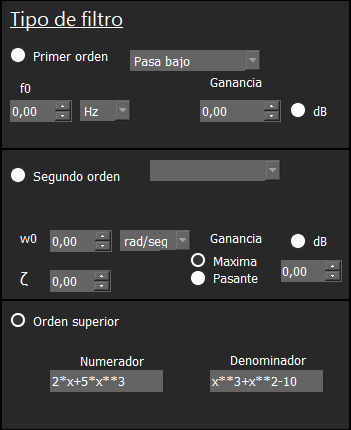
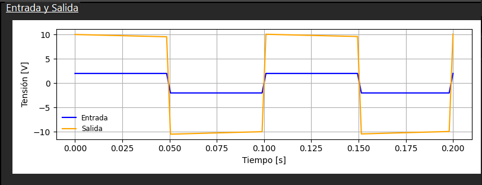
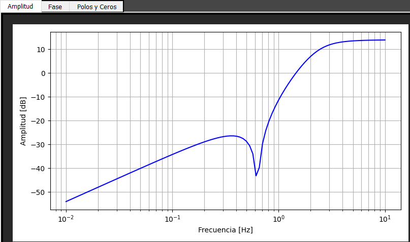
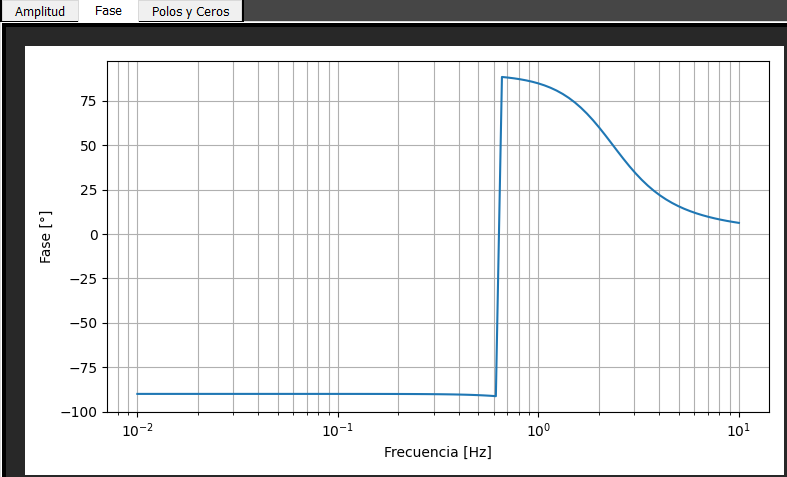

Como se puede apreciar, la interfaz se divide en cuatro partes principales, las cuales son:

1. **Señal de entrada**: Cuenta con 6 tipos de señales cuyos parámetros de amplitud y, en caso de ser periódica, frecuencia pueden ser modificados. Además, es posible modificar las escalas del valor ingresado en "Amplitud" y "Frecuencia" mediante el desplegable con su unidad.

   Por un lado se encuentran señales periódicas como la senoide, el pulso y la triangular, las cuales son señales comúnmente usadas en la práctica electrónica. Por el otro se encuentran señales como el escalón, la exponencial (la cual simula una señal amortiguada) y el impulso o delta de Dirac, señales que permiten analizar respuestas particulares de cada filtro.

   

2. **Tipo de filtro**: Permite la selección del orden y del tipo de filtro que se le quiere aplicar a la entrada.

   Las opciones que permite seleccionar dentro de filtro de primer orden son:
   - Pasa bajo
   - Pasa alto
   - Pasa todo

   Asimismo, la frecuencia de corte f0 y la ganancia del filtro (en veces) son configurables; nuevamente, la escala de la frecuencia de corte puede modificarse.

   Pasando a los filtros de segundo orden, los diferentes tipos que se han son:
   - Pasa bajo
   - Pasa alto
   - Pasa todo
   - Pasa banda
   - Notch

   En este caso se puede modificar la frecuencia angular de corte (y su escala), así como el coeficiente de amortiguamiento. Si es pasa banda, se puede configurar su ganancia en banda pasante, y si no lo es, su ganancia máxima.

   Por último, para filtros de orden superior la interfaz permite ingresar el polinomio de la función de transferencia en forma de numerador y denominador. Una importante aclaración a tener en cuenta es que el formato debe ser como el que sigue: $a_{n}$*x**$n$ + $a_{n-1}$*x**n-1 + ... + $a_{1}$*x + $a_{0}$.
    
   Donde se resalta que se debe usar una x como variable, los coeficientes deben ir antes e ir acompañados por el símbolo "*" (pueden ser 0 o no estar algún orden) y la potencia debe venir pegada a la x luego del símbolo "**".

   

3. **Gráfico de entrada y salida**: 
   El simulador de filtros proporciona una representación visual clara de cómo funcionan los filtros en un gráfico. En el gráfico, puedes observar dos señales: la señal de entrada y la señal filtrada. La señal de entrada se muestra en color azul. Esta señal representa la señal original o sin procesar que ingresa al filtro. Es importante tener en cuenta que esta señal no ha sido modificada ni filtrada todavía.

   Superpuesta a la señal de entrada, se podrá observar la señal filtrada, la cual se muestra en color naranja. Esta señal es el resultado de aplicar el filtro a la señal de entrada. El filtro ha procesado la señal original, eliminando o atenuando ciertos componentes y dejando pasar otros. La señal filtrada es el resultado de este proceso de filtrado y puede mostrar cambios en su forma, amplitud o frecuencia dependiendo del tipo y configuración del filtro utilizado.

   

4. **Gráfico de función de Transferencia**:
   En esta sección se encuentran 3 gráficos característicos de la función de transferencia: el gráfico de amplitud, de fase y el diagrama de polos y ceros. Para acceder a cada uno de estos gráficos basta con seleccionar la pestaña deseada en la esquina superior izquierda de la sección.

   El diagrama de amplitud de Bode tiene en su eje horizontal la frecuencia de la señal (Hz), mientras que en el vertical está la ganancia en decibeles (dB) correspondiente a la señal en respuesta a cada frecuencia.

   

   El diagrama de fase de Bode es el análogo al anterior, reemplazando la ganancia (dB) por el desfasaje entre la tensión y la corriente en la salida, medido en grados eulerianos.

   

   Por último, el diagrama de polos y ceros es característico del numerador y el denominador de la función de transferencia. Los ceros se representan con una 'o', mientras que su contraparte con una 'x'.

   
